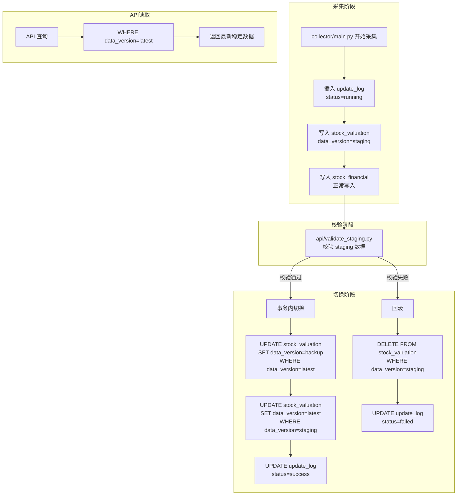

# 股票数据安全双版本更新策略

## 一、现状分析

### 数据存储方式
项目使用 **MySQL** 存储运行数据，CSV 文件仅用于股票池列表。

### 核心数据库表
| 表名 | 用途 | 更新方式 |
|------|------|----------|
| `stock_basic` | 股票基础信息（代码、名称、板块） | INSERT ... ON DUPLICATE KEY UPDATE |
| `stock_valuation` | 估值数据（PE、PB、trade_date） | 每次采集写入新 `trade_date` 的行 |
| `stock_financial` | 财务数据（ROE、增长率、股息率） | INSERT ... ON DUPLICATE KEY UPDATE（按 report_date 覆盖） |

### 当前风险点
1. `stock_valuation` 写入新 `trade_date` 数据时是逐行 INSERT，**写入过程中 API 就能读到新日期**，此时只有部分股票数据
2. 采集过程中断（超时/异常），会导致部分数据写入、部分未写入的不一致状态
3. 无回滚机制，失败的采集无法自动恢复

### 前端估值日期读取方式
前端已从 API 返回的 `first.trade_date` 动态读取估值日期（见 [`frontend/index.html:1499`](frontend/index.html:1499)），**并未写死**，此要求已满足。

---

## 二、设计方案

### 核心思路
在 `stock_valuation` 表上增加 `data_version` 字段，将写入链路改为：**staging → 校验 → promote（latest/backup）**。

由于 `stock_financial` 使用 `ON DUPLICATE KEY UPDATE COALESCE` 更新同一 report_date，风险较低，暂不纳入版本管理以保持最小改动。

### 数据流架构图



---

## 三、修改清单

### 3.1 数据库变更（[`database/add_data_version.sql`](database/add_data_version.sql) 新增）

#### 表结构变更
```sql
-- 1. stock_valuation 增加 data_version 字段
ALTER TABLE stock_valuation
    ADD COLUMN data_version VARCHAR(16) NOT NULL DEFAULT 'latest'
    COMMENT '数据版本: latest/backup/staging',
    ADD INDEX idx_data_version (data_version);

-- 2. 新增 update_log 表
CREATE TABLE IF NOT EXISTS update_log (
    id INT AUTO_INCREMENT PRIMARY KEY,
    update_type VARCHAR(32) NOT NULL COMMENT '更新类型: valuation/financial/full',
    status VARCHAR(16) NOT NULL COMMENT '运行状态: running/success/failed',
    staging_trade_date DATE COMMENT '本次 staging 的交易日',
    stock_count INT COMMENT 'staging 股票数量',
    validation_errors TEXT COMMENT '校验错误信息',
    error_message TEXT COMMENT '异常错误信息',
    started_at TIMESTAMP DEFAULT CURRENT_TIMESTAMP,
    finished_at TIMESTAMP NULL,
    INDEX idx_status (status),
    INDEX idx_started_at (started_at)
) ENGINE=InnoDB DEFAULT CHARSET=utf8mb4 COMMENT='更新日志表';
```

> **注意**：`stock_financial` 不做版本管理，因为它使用 `ON DUPLICATE KEY UPDATE COALESCE` 安全更新模式。

### 3.2 新增文件：[`api/validate_staging.py`](api/validate_staging.py)

校验 staging 数据的完整性和质量。

```python
def validate_staging_data(trade_date: str) -> tuple[bool, list[str]]:
    """
    校验 staging 版本的估值数据。
    
    校验规则：
    1. 股票数量 >= 2500
    2. 必需字段存在（bs_code, pe_ttm, pb, trade_date）
    3. valuation_date（trade_date）必须等于预期日期
    4. 尝试运行评分引擎，检查 final_score 不全为空
    
    返回：(passed, errors)
    """
```

校验规则详细：
| # | 规则 | 说明 |
|---|------|------|
| 1 | 股票数 >= 2500 | 沪深主板通常有 ~3000+ 只股票 |
| 2 | 核心字段非空 | `bs_code`, `name`, `pe_ttm`, `pb`, `trade_date` 必须存在且非空比例 > 50% |
| 3 | `trade_date` 一致 | staging 数据的 trade_date 必须等于本次更新的预期日期 |
| 4 | 评分可运行 | 用 staging 数据运行 `calculate_score`，`final_score` 不能全部为 NULL |

### 3.3 修改文件：[`collector/save_to_mysql.py`](collector/save_to_mysql.py)

修改 `save_stock_valuation_to_mysql()` 函数，新增 `data_version` 参数：

```python
def save_stock_valuation_to_mysql(
    valuation_df: pd.DataFrame,
    data_version: str = "latest"
) -> dict:
    # 在 INSERT 语句中加入 data_version 字段
    # ...
```

### 3.4 修改文件：[`collector/main.py`](collector/main.py)

采集主流程改为 staging 模式：

```python
def main(limit=None):
    # 1. 生成新的 trade_date
    trade_date = datetime.now().strftime("%Y-%m-%d")
    
    # 2. 记录更新日志
    log_id = insert_update_log(update_type='full', status='running')
    
    try:
        # 3. 采集股票池（不变）
        stock_pool_df = fetch_stock_pool(limit=limit)
        save_stock_basic_to_mysql(stock_pool_df)
        
        # 4. 写入估值数据到 staging
        valuation_df = fetch_stock_valuation(trade_date, stock_pool=stock_pool_df)
        save_stock_valuation_to_mysql(valuation_df, data_version='staging')
        
        # 5. 写入财务数据（不变，使用 COALESCE 安全更新）
        financial_df = fetch_stock_financial(stock_pool=stock_pool_df)
        save_stock_financial_to_mysql(financial_df)
        
        # 6. 更新股息率（不变）
        update_dividend_yield(stock_pool=stock_pool_df)
        
        # 7. 校验 staging 数据
        passed, errors = validate_staging_data(trade_date)
        
        if passed:
            # 8. 切换版本：latest → backup, staging → latest
            promote_staging(trade_date)
            update_log_status(log_id, status='success')
            print(f"✅ 数据更新成功，交易日：{trade_date}")
        else:
            # 9. 校验失败：删除 staging，保留 latest
            rollback_staging(trade_date)
            update_log_status(log_id, status='failed', 
                            validation_errors='; '.join(errors))
            print(f"❌ 数据校验失败：{errors}")
            
    except Exception as e:
        # 10. 异常：删除 staging，保留 latest
        rollback_staging(trade_date)
        update_log_status(log_id, status='failed', error_message=str(e))
        print(f"❌ 采集异常：{e}")
```

### 3.5 修改文件：[`api/scoring.py`](api/scoring.py)

`get_latest_strategy_data()` 函数中的 SQL 增加 `data_version` 过滤：

```sql
-- 修改前
WHERE v.trade_date = (SELECT MAX(trade_date) FROM stock_valuation)

-- 修改后
WHERE v.data_version = 'latest'
  AND v.trade_date = (SELECT MAX(trade_date) FROM stock_valuation WHERE data_version = 'latest')
```

### 3.6 修改文件：[`api/api.py`](api/api.py)

`_search_stocks_raw()` 函数中的 SQL 同样增加 `data_version` 过滤：

```sql
-- 修改前
WHERE v.trade_date = (SELECT MAX(trade_date) FROM stock_valuation)

-- 修改后
WHERE v.data_version = 'latest'
  AND v.trade_date = (SELECT MAX(trade_date) FROM stock_valuation WHERE data_version = 'latest')
```

### 3.7 修改文件：[`api/screen_stocks.py`](api/screen_stocks.py)

`screen_low_pe_stocks()` 函数中的 SQL 同样增加 `data_version` 过滤：

```sql
-- 修改前
WHERE v.trade_date = (SELECT MAX(trade_date) FROM stock_valuation)

-- 修改后
WHERE v.data_version = 'latest'
  AND v.trade_date = (SELECT MAX(trade_date) FROM stock_valuation WHERE data_version = 'latest')
```

### 3.8 新增 API 端点：[`api/api.py`](api/api.py)

增加 `/valuation/date` 端点，供前端确认最新估值日期：

```python
@app.get("/valuation/date")
def get_valuation_date():
    """返回 latest 版本的最新估值日期。"""
    engine = get_engine()
    sql = text("""
        SELECT MAX(trade_date) as valuation_date
        FROM stock_valuation
        WHERE data_version = 'latest'
    """)
    df = pd.read_sql(sql, engine)
    date_val = df.iloc[0]['valuation_date'] if not df.empty else None
    return {
        "valuation_date": str(date_val) if date_val else None,
        "data_version": "latest",
    }
```

---

## 四、不变/无需改动的部分

| 模块 | 原因 |
|------|------|
| `frontend/index.html` | 已从 API 动态读取 `trade_date`，无需改动 |
| `collector/update_stock_pool.py` | 股票池 CSV 更新逻辑独立，不影响运行时数据 |
| `collector/fetch_a_stock.py` | 数据获取逻辑不变，只需在入库时指定版本 |
| `collector/fetch_financial.py` | 财务数据获取逻辑不变 |
| `collector/update_dividend_akshare.py` | 股息率更新逻辑不变 |
| `api/risk.py` | 风险评估纯函数，无数据库查询 |
| `api/stock_utils.py` | 工具函数，无数据库查询 |
| `api/factor_config.py` | 纯配置，无数据库查询 |
| `api/db.py` | 数据库连接逻辑不变 |
| `data/` 目录下 CSV 文件 | 仅股票池列表，不做版本管理 |

---

## 五、回滚方案

如果新方案出现问题，可以快速回滚：

1. **数据库回滚**：执行 `ALTER TABLE stock_valuation DROP COLUMN data_version; DROP TABLE update_log;`
2. **代码回退**：撤销文件中所有 `data_version` 相关改动
3. **数据恢复**：如果 backup 版本还在，可以手动执行 `UPDATE stock_valuation SET data_version='latest' WHERE data_version='backup'`

---

## 六、执行顺序

| 步骤 | 文件 | 操作 | 说明 |
|------|------|------|------|
| 1 | `database/add_data_version.sql` | 新增 | 执行 DDL 变更数据库 |
| 2 | `api/validate_staging.py` | 新增 | 实现校验逻辑 |
| 3 | `collector/save_to_mysql.py` | 修改 | save 函数增加 data_version 参数 |
| 4 | `collector/main.py` | 修改 | 主流程改为 staging → validate → promote |
| 5 | `api/scoring.py` | 修改 | SQL 增加 data_version 过滤 |
| 6 | `api/api.py` | 修改 | SQL 增加 data_version 过滤，新增 /valuation/date |
| 7 | `api/screen_stocks.py` | 修改 | SQL 增加 data_version 过滤 |
| 8 | 测试验证 | - | 运行采集 → 校验 → 确认 API 返回正确 |

---

## 七、关键改动一览

### 新增文件
- [`database/add_data_version.sql`](database/add_data_version.sql) - 数据库迁移脚本
- [`api/validate_staging.py`](api/validate_staging.py) - 数据校验模块

### 修改文件
- [`collector/save_to_mysql.py`](collector/save_to_mysql.py) - 写入函数增加 data_version
- [`collector/main.py`](collector/main.py) - 采集流程改用 staging
- [`api/scoring.py`](api/scoring.py) - 查询增加 data_version 过滤
- [`api/api.py`](api/api.py) - 查询增加 data_version 过滤 + 新端点
- [`api/screen_stocks.py`](api/screen_stocks.py) - 查询增加 data_version 过滤

### 无需改动
- `frontend/index.html` - 已动态读取估值日期
- `collector/fetch_a_stock.py` - 获取逻辑不变
- `collector/fetch_financial.py` - 获取逻辑不变
- `collector/update_dividend_akshare.py` - 更新逻辑不变
- `api/risk.py` / `api/stock_utils.py` / `api/factor_config.py` / `api/db.py` - 无敏感查询
