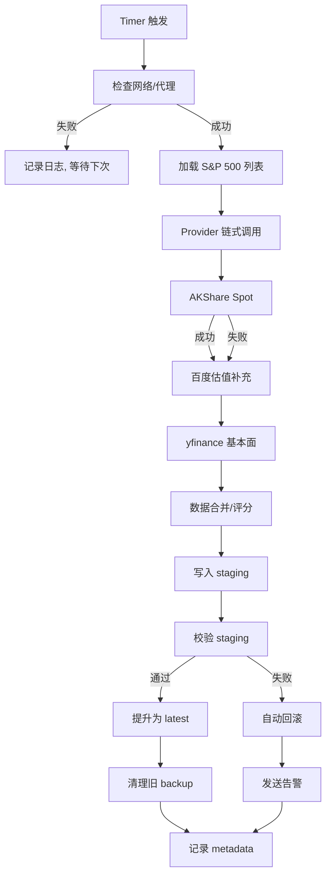

# 美股数据源系统重构计划

## 现状分析

### 当前文件结构
```
collector/update_us_stocks.py    # 美股数据采集主脚本（~580行，单体文件）
api/us_stock_utils.py            # 美股评分工具（~340行）
api/api.py                       # API 路由（美股部分在 609-722 行）
data/us_stocks/
├── latest.json                  # 当前最新数据（~8868行）
├── cache/
│   ├── financial_cache.json     # yfinance 基本面缓存
│   └── daily_cache.json         # 行情缓存
├── sp500_symbols.csv            # S&P 500 成分股备份
data/sp500_symbols.csv           # S&P 500 成分股主文件
```

### 当前问题清单

| 问题 | 严重程度 | 说明 |
|------|---------|------|
| yfinance 限流 | 🔴 高 | 串行请求 500+ ticker，无重试/超时控制 |
| PE/PB/dividend_yield 大量为空 | 🔴 高 | latest.json 中 pe/pb 几乎全 null |
| provider 不稳定 | 🟡 中 | 单 provider 崩溃导致整个流程中断 |
| 字段来源混乱 | 🟡 中 | AKShare/yfinance/百度 数据混合，无统一 schema |
| cache 结构不统一 | 🟡 中 | financial_cache.json 和 daily_cache.json 格式不同 |
| 无 proxy 配置 | 🟡 中 | 海外 API 请求无统一代理 |
| 评分逻辑沿用 A 股 | 🟡 中 | 科技股高 PE 被惩罚，不合理 |
| 无自动更新机制 | 🟢 低 | 需手动运行脚本 |
| 无 provider 日志 | 🟢 低 | 无法追踪各 provider 状态 |

---

## 第一阶段：数据源稳定化

### 目标
统一所有海外请求走代理，增加超时/重试/fallback 机制。

### 修改文件

| 文件 | 操作 | 说明 |
|------|------|------|
| `config/config.example.py` | **修改** | 增加 PROXY_CONFIG 配置 |
| `config/config.py` | **修改** | 添加实际 proxy 配置 |
| `collector/proxy_utils.py` | **新建** | 统一 proxy/retry/timeout 工具模块 |
| `collector/update_us_stocks.py` | **修改** | 接入 proxy_utils，增加 provider 日志 |

### 详细设计

#### 1. proxy_utils.py 设计

```python
# 统一代理配置
PROXY_CONFIG = {
    "http": "http://127.0.0.1:7890",
    "https": "http://127.0.0.1:7890",
}

# 统一 requests session 工厂
def get_requests_session(timeout=30, retries=3):
    """返回配置了 proxy/timeout/retry 的 requests.Session"""
    
# 统一 httpx client 工厂
def get_httpx_client(timeout=30, retries=3):
    """返回配置了 proxy/timeout 的 httpx.Client"""

# yfinance session 配置
def patch_yfinance_session():
    """为 yfinance 设置 proxy session"""
    
# Provider 日志装饰器
def log_provider(name: str):
    """记录 provider 调用：名称、成功/失败、响应时间"""
```

#### 2. 接入方式

- `requests`: 通过 `Session.proxies` 设置
- `httpx`: 通过 `Client(proxies=...)` 设置
- `yfinance`: 通过 `yf.Ticker(..., session=patched_session)` 设置
- 环境变量: `HTTP_PROXY`/`HTTPS_PROXY` 自动读取

#### 3. Provider 日志格式

```python
{
    "provider": "yfinance",
    "action": "fetch_fundamentals",
    "status": "success" | "fail",
    "response_time_ms": 1234,
    "ticker_count": 500,
    "success_count": 450,
    "failed_count": 50,
    "error": "rate limited"  # 仅失败时
}
```

### 风险与回滚

| 风险 | 缓解措施 | 回滚方式 |
|------|---------|---------|
| proxy 配置错误导致请求失败 | 添加 proxy 可用性检测 | 删除 proxy 配置恢复直连 |
| yfinance session 补丁不兼容 | 保留原 session 创建方式作为 fallback | 回退 proxy_utils.py |
| 日志过多影响性能 | 日志级别可配置 | 调整日志级别 |

---

## 第二阶段：统一数据结构

### 目标
建立标准化美股数据 schema，所有 provider 返回统一 dict。

### 修改文件

| 文件 | 操作 | 说明 |
|------|------|------|
| `api/us_stock_schema.py` | **新建** | 统一数据 schema 定义 + normalize 层 |
| `collector/update_us_stocks.py` | **修改** | 使用统一 schema 处理数据 |
| `api/us_stock_utils.py` | **不改** | 评分逻辑不变，仅消费 schema 输出 |

### 统一字段定义

```python
US_STOCK_SCHEMA = {
    "ticker": str,           # 股票代码
    "name": str,             # 公司名称
    "sector": str,           # 行业板块
    "industry": str,         # 细分行业
    "market_cap": float,     # 总市值
    "pe": float,             # 市盈率
    "pb": float,             # 市净率
    "dividend_yield": float, # 股息率(%)
    "roe": float,            # ROE(%)
    "revenue_growth": float, # 营收增长率(%)
    "profit_growth": float,  # 利润增长率(%)
    "final_score": float,    # 综合评分
    "update_time": str,      # 更新时间
    "provider": str,         # 数据来源
}
```

### normalize 层

```python
def normalize_record(record: dict, provider: str) -> dict:
    """
    统一数据清洗：
    1. NaN -> None
    2. float/int 类型统一
    3. 缺失字段补 None
    4. 添加 provider 标记
    5. 添加 update_time
    """
```

### 前端兼容性

- 前端使用的字段名（code, name, sector, pe, pb, roe 等）**保持不变**
- 新增字段（market_cap, industry, provider）不影响前端
- `api/api.py` 中 `get_us_stocks()` 的返回格式不变

### 风险与回滚

| 风险 | 缓解措施 | 回滚方式 |
|------|---------|---------|
| 字段名变更影响前端 | 不修改前端使用的字段名 | 回退 us_stock_schema.py |
| normalize 逻辑错误导致数据丢失 | 保留原始数据备份 | 从 raw 目录恢复 |

---

## 第三阶段：缓存体系重构

### 目标
建立 staging/latest/cache/raw/backup 分层缓存结构。

### 修改文件

| 文件 | 操作 | 说明 |
|------|------|------|
| `collector/cache_manager.py` | **新建** | 缓存管理工具类 |
| `collector/update_us_stocks.py` | **修改** | 使用新缓存体系 |
| `api/api.py` | **不改** | 仍读取 latest.json |

### 目录结构

```
data/us_stocks/
├── raw/                          # provider 原始数据
│   ├── akshare_spot_20260513.json
│   ├── yfinance_fundamentals_20260513.json
│   └── baidu_valuation_20260513.json
├── cache/                        # 增量缓存
│   ├── financial_cache.json      # 保留现有格式
│   └── daily_cache.json          # 保留现有格式
├── staging.json                  # 暂存区（待校验）
├── latest.json                   # 当前最新（不变）
├── backup/                       # 历史快照
│   ├── latest_20260512.json
│   └── latest_20260511.json
└── metadata.json                 # 更新元数据
```

### metadata.json 格式

```json
{
    "last_update": "2026-05-13T10:00:00",
    "provider_status": {
        "akshare_spot": {"last_success": "...", "success_rate": 0.95},
        "yfinance": {"last_success": "...", "success_rate": 0.80},
        "baidu_valuation": {"last_success": "...", "success_rate": 0.90}
    },
    "stats": {
        "total_tickers": 503,
        "with_pe": 350,
        "with_pb": 300,
        "with_roe": 450,
        "with_dividend": 200
    }
}
```

### 增量更新策略

1. 检查 cache 中是否有 24h 内的数据
2. 有则跳过该 ticker 的 yfinance 请求
3. 只对过期/缺失的 ticker 发起请求
4. 合并新旧数据后写入 staging

### 风险与回滚

| 风险 | 缓解措施 | 回滚方式 |
|------|---------|---------|
| 新目录结构破坏现有路径 | 保留对旧路径的兼容读取 | 恢复旧目录结构 |
| 增量更新逻辑 bug | staging 校验机制不变 | 从 backup 恢复 |
| 磁盘空间增长 | 限制 backup 保留 7 天 | 手动清理 backup |

---

## 第四阶段：Provider 抽象层

### 目标
建立 provider adapter 架构，支持热切换和自动 fallback。

### 修改文件

| 文件 | 操作 | 说明 |
|------|------|------|
| `collector/providers/__init__.py` | **新建** | provider 包初始化 |
| `collector/providers/base.py` | **新建** | BaseProvider 抽象基类 |
| `collector/providers/akshare_provider.py` | **新建** | AKShare provider 实现 |
| `collector/providers/yfinance_provider.py` | **新建** | yfinance provider 实现 |
| `collector/providers/finnhub_provider.py` | **新建** | Finnhub provider 预留 |
| `collector/update_us_stocks.py` | **重构** | 使用 provider 架构重写 |

### BaseProvider 接口

```python
class BaseProvider(ABC):
    @abstractmethod
    def fetch_basic_info(self, tickers: list[str]) -> dict[str, dict]:
        """获取基本信息（价格、市值等）"""
    
    @abstractmethod
    def fetch_financials(self, tickers: list[str]) -> dict[str, dict]:
        """获取财务数据（ROE、增长率等）"""
    
    @abstractmethod
    def fetch_valuation(self, tickers: list[str]) -> dict[str, dict]:
        """获取估值数据（PE、PB等）"""
    
    @property
    @abstractmethod
    def name(self) -> str:
        """provider 名称"""
    
    @property
    @abstractmethod
    def priority(self) -> int:
        """优先级（数字越小越优先）"""
```

### Provider 注册与 Fallback

```python
PROVIDER_REGISTRY = [
    AKShareProvider(),    # priority=1
    YFinanceProvider(),   # priority=2
    FinnhubProvider(),    # priority=3 (预留)
]

def get_provider(action: str) -> BaseProvider:
    """按 action 类型获取最优 provider，失败自动 fallback"""
```

### 热切换支持

- 通过 `config.py` 中的 `PROVIDER_CONFIG` 控制启用/禁用
- 运行时动态加载 provider 模块
- 新增 provider 只需实现 BaseProvider 接口并注册

### 风险与回滚

| 风险 | 缓解措施 | 回滚方式 |
|------|---------|---------|
| 抽象层过度设计 | 保持接口最小化 | 回退 providers/ 目录 |
| provider 注册顺序错误 | 按 priority 排序 | 调整 priority 值 |
| 新 provider 不稳定 | 保留旧代码路径 | 切换回旧 update_us_stocks.py |

---

## 第五阶段：评分系统优化

### 目标
修复美股评分逻辑，支持 sector 内排名和科技股高 PE 容忍。

### 修改文件

| 文件 | 操作 | 说明 |
|------|------|------|
| `api/us_stock_utils.py` | **修改** | 增加 sector 内排名、行业感知评分 |
| `api/api.py` | **不改** | API 接口不变 |

### 评分改进

#### 当前问题
```python
# 当前：全市场统一排名，科技股高 PE 被惩罚
US_FACTOR_CONFIG = {
    "pe": {"direction": "lower_better", "weight": 63},  # ❌ 科技股 PE 30+ 直接低分
}
```

#### 改进方案

```python
def calculate_us_score_v2(df: pd.DataFrame) -> pd.DataFrame:
    """
    新版美股评分：
    1. sector 内 percentile ranking
    2. 科技股允许高 PE（sector 内相对估值）
    3. growth score 独立计算
    4. profitability score 独立计算
    5. valuation score 使用 sector 内排名
    6. final weighted score
    """
```

#### 评分维度

| 维度 | 权重 | 说明 |
|------|------|------|
| 估值 (Valuation) | 20% | sector 内 PE/PB percentile 排名 |
| 盈利 (Profitability) | 30% | ROE sector 内排名 |
| 成长 (Growth) | 30% | 营收/利润增长率 sector 内排名 |
| 股东回报 (Dividend) | 20% | 股息率 sector 内排名 |

#### Sector 内排名示例

```
科技股 PE 排名：
  - NVDA PE=75 → 科技 sector 内 PE 排名 80/100 → 估值分 20（相对合理）
  - JPM PE=12 → 金融 sector 内 PE 排名 10/100 → 估值分 90（确实低估）

对比旧逻辑：
  - NVDA PE=75 → 全市场排名 → 估值分 5（❌ 严重低估科技股）
  - JPM PE=12 → 全市场排名 → 估值分 85（✅）
```

### 风险与回滚

| 风险 | 缓解措施 | 回滚方式 |
|------|---------|---------|
| 评分结果大幅变化 | 保留旧评分函数作为对比 | 切回旧 calculate_us_score |
| sector 分类不准确 | 使用 Wikipedia GICS sector | 回退 us_stock_utils.py |
| 前端显示不适应 | 前端只消费 final_score，不受影响 | 无需回滚前端 |

---

## 第六阶段：自动更新系统

### 目标
建立 cron/systemd timer 自动更新 pipeline。

### 修改文件

| 文件 | 操作 | 说明 |
|------|------|------|
| `collector/auto_update.py` | **新建** | 自动更新入口脚本 |
| `scripts/update_us_stocks.sh` | **新建** | shell 包装脚本 |
| `/etc/systemd/system/us-stock-update.service` | **新建** | systemd service |
| `/etc/systemd/system/us-stock-update.timer` | **新建** | systemd timer |

### 自动更新流程



### 日志管理

```
logs/
├── update.log              # 当前日志
├── update_20260513.log     # 每日轮转
└── update_error.log        # 错误日志
```

### 单 ticker 更新支持

```bash
python -m collector.update_us_stocks --ticker AAPL
python -m collector.update_us_stocks --ticker AAPL,MSFT,GOOGL
```

### 风险与回滚

| 风险 | 缓解措施 | 回滚方式 |
|------|---------|---------|
| 自动更新干扰手动操作 | 检查是否有正在运行的更新 | 停止 timer |
| 更新失败导致数据丢失 | staging 校验 + 自动回滚 | 从 backup 恢复 |
| 日志轮转丢失历史 | 保留 30 天日志 | 手动归档 |

---

## 执行顺序与依赖关系

```mermaid
flowchart LR
    subgraph 第一阶段
        A1[proxy_utils.py] --> A2[修改 config]
        A2 --> A3[接入 update_us_stocks]
    end
    
    subgraph 第二阶段
        B1[us_stock_schema.py] --> B2[normalize 层]
        B2 --> B3[修改数据合并逻辑]
    end
    
    subgraph 第三阶段
        C1[cache_manager.py] --> C2[目录结构调整]
        C2 --> C3[增量更新逻辑]
    end
    
    subgraph 第四阶段
        D1[base.py] --> D2[akshare_provider]
        D1 --> D3[yfinance_provider]
        D2 --> D4[provider 注册]
        D3 --> D4
    end
    
    subgraph 第五阶段
        E1[评分逻辑改进]
    end
    
    subgraph 第六阶段
        F1[auto_update.py] --> F2[systemd timer]
    end
    
    A3 --> B1
    B3 --> C1
    C3 --> D1
    D4 --> E1
    E1 --> F1
```



### 依赖关系

| 阶段 | 依赖 | 可独立部署 |
|------|------|-----------|
| 第一阶段 | 无 | ✅ 是 |
| 第二阶段 | 第一阶段 | ✅ 是（仅依赖 proxy） |
| 第三阶段 | 第一、二阶段 | ✅ 是 |
| 第四阶段 | 第一、二、三阶段 | ❌ 需前三阶段 |
| 第五阶段 | 第二阶段 | ✅ 是（依赖 schema） |
| 第六阶段 | 全部 | ❌ 需前五阶段 |

---

## 测试计划

### 每阶段测试

| 阶段 | 测试项 | 验证方法 |
|------|--------|---------|
| 第一阶段 | proxy 连通性 | `curl -x 127.0.0.1:7890 https://api.github.com` |
| 第一阶段 | yfinance 通过 proxy | 运行单 ticker 测试 |
| 第一阶段 | provider 日志 | 检查日志输出格式 |
| 第二阶段 | schema normalize | 输入脏数据验证输出 |
| 第二阶段 | 前端兼容性 | 请求 `/stocks?market=us` 检查字段 |
| 第三阶段 | 目录结构 | `ls -la data/us_stocks/` |
| 第三阶段 | 增量更新 | 连续运行两次，检查 cache 命中 |
| 第四阶段 | provider fallback | 禁用主 provider 验证 fallback |
| 第五阶段 | 评分合理性 | 检查科技股评分是否合理 |
| 第六阶段 | timer 触发 | `systemctl list-timers` |

### 回滚验证

每阶段修改后，确保：
1. `python -m collector.update_us_stocks` 正常运行
2. API `/stocks?market=us` 返回正常数据
3. 前端 `us.html` 正常渲染

---

## 重要注意事项

1. **不要修改前端** - 所有修改限于后端和采集层
2. **不要影响 A 股模块** - A 股代码路径完全不动
3. **不要删除现有 cache 数据** - 保留 financial_cache.json 和 daily_cache.json
4. **分阶段提交** - 每阶段完成后 git commit
5. **大改前提醒用户 git commit** - 遵循项目工作规则
6. **优先稳定性** - 每阶段都有回滚方案
